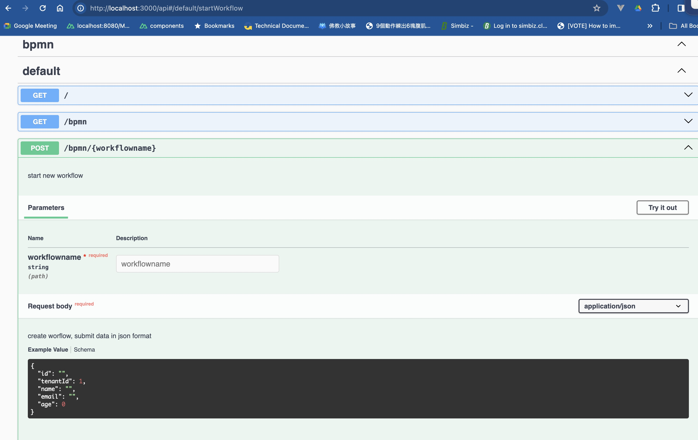

# nestjs-bpmn-server
This project demonstrate how to integrate bpmn-server with nestjs + openapi

it is minimal configuration: if you wish to:
1. implement bearen token authorization may refer nestjs. such as using keycloak and etc
2. it only show case how to use controller+swaggerui and service class. Deligate/Configuration only have minimal change to work with nestjs

Ensure your mongodb server is up and running 
after check out the project then:
```sh
cd ./nestbpmn
pnpm install
pnpm start:dev # if you have error check .env mongodb setting
```




# How to setup from zero
```sh
npm i -g @nestjs/cli  # install nest cli tools, if you have can skip it
nest new nestbpmn -p pnpm
pnpm i @nestjs/mongoose mongoose #https://docs.nestjs.com/techniques/mongodb
pnpm install @nestjs/swagger  #https://docs.nestjs.com/openapi/introduction
pnpm install bpmn-server
pnpm install yaml
```


# Setup Environment
create `.env` file at root folder
```
MONGO_DB_URL=mongodb://127.0.0.1:27017/bpmn
MONGO_DB_NAME=bpmn
DEFINITIONS_PATH="./bpmn/"
```

# modify main.ts to support openapi
```ts
import { NestFactory } from '@nestjs/core';
import { AppModule } from './app.module';
// new imports start
import { SwaggerModule, DocumentBuilder } from '@nestjs/swagger';
import {writeFileSync} from 'fs';
const yaml = require('yaml');
// new imports end

async function bootstrap() {
  const app = await NestFactory.create(AppModule);
  // setup openapi playground using swagger-ui start
  const config = new DocumentBuilder()
  .setTitle('Cats example')
  .setDescription('The cats API description')
  .setVersion('1.0')
  .build();
  const document = SwaggerModule.createDocument(app, config);
  SwaggerModule.setup('api', app, document,{
    swaggerOptions: { showExtensions: true, persistAuthorization: true },
  });  
  // setup openapi playground using swagger-ui end 

  //optional steps, help you prepare openapi.yaml file, can use this file to generate api client in different languages
  writeFileSync('./openapi.yaml', yaml.stringify(document));
  
  await app.listen(3000);
}
bootstrap();
```


# create bpmn module
1. put sample bpmn file into project, my example is `./bpmn/sample.bpmn`  (shall match `DEFINITIONS_PATH` in `.env`)
2. create nestjs module folder `./src/bpmn`
3. copy `appDelegate.ts, configuration.ts` from `bpmn-server/WebApp` into `./src/bpmn`, modify first row to import from `bpmn-server`
4. prepare `bpmn.apischema.ts`, it use to produce apischema. The pattern of data will appear in `swagger-ui` and `openapi.yaml`
5. prepare `bpmn.controller.ts, bpmn.module.ts, bpmn.service.ts` as the source code

# Activate bpmn module
in order to activate the bpmn module, we shall import `BPMNModule`, change `./src/app.module.ts`, after this step you can start bpmn service as early step in this readme.

```ts
import { Module } from '@nestjs/common';
import { AppController } from './app.controller';
import { AppService } from './app.service';
import {BPMNModule} from './bpmn/bpmn.module'  //import BPMN module

@Module({
  imports: [BPMNModule],   //activate bpmn module here
  controllers: [AppController],
  providers: [AppService],
})
export class AppModule {}
```


